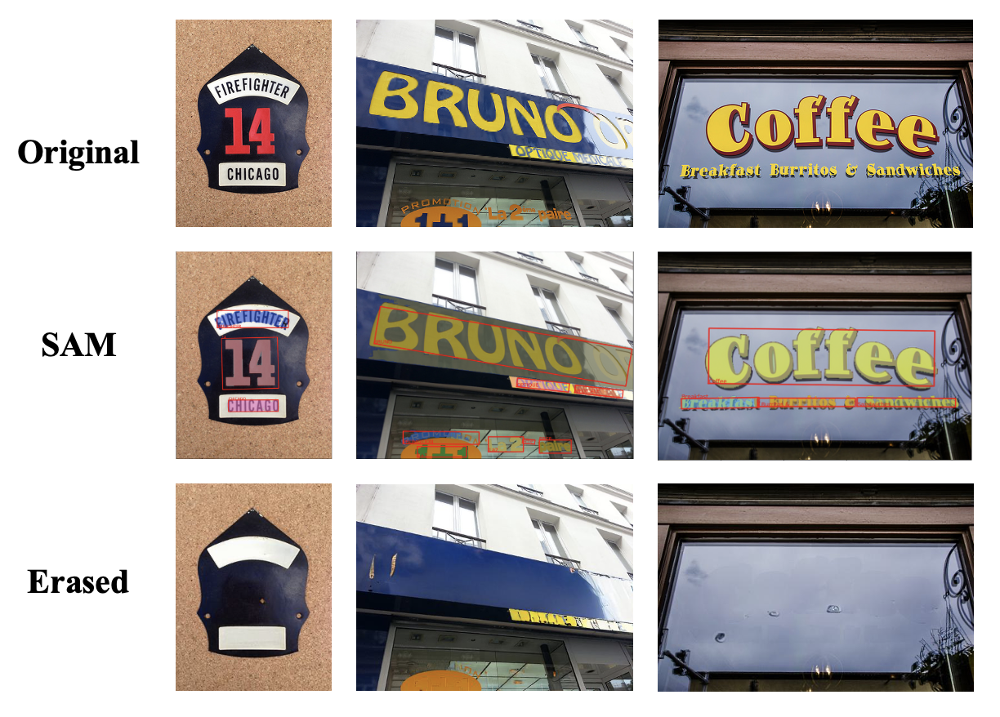

# OCR-SAM

## 🐇 Introduction 🐙
This repository is mainly to combine the TextDetector, TextRecgonizer，[Segment Anything](https://github.com/facebookresearch/segment-anything) and other Adavanced Tech to develop some **OCR-related Application Demo**. And we provide the **WebUI by gradio** and **Colab** to make user to have better interaction.  

*Note: We will continue to update and maintain this repo, and develop more OCR-related advanced applications demo to the community. **Welcome anyones to join who have the idea and want to contribute to our repo**.*

## 📅 Updates 👀
- **2023.04.12**: Repository Release
- **2023.04.12**: Supported the [Inpainting](#🏃🏻‍♂️-Run-Demo#Inpainting) combined with DBNet++, SAM and ControlNet.
- **2023.04.11**: Supported the [Erasing](#🏃🏻‍♂️-Run-Demo#Erasing) combined with DBNet++, SAM and Latent-Diffusion / Stable-Diffusion.

## 📸 Demo Zoo 🔥

This project includes:
- [x] [SAM_for Text](#🏃🏻‍♂️-Run-Demo#SAM-for-Text)

- [x] [Erasing](#🏃🏻‍♂️-Run-Demo#Erasing): DBNet++ + SAM + Latent-Diffusion / Stable Diffusion 

- [x] [Inpainting](#🏃🏻‍♂️-Run-Demo#Inpainting)


## 🚧 Installation 🛠️
### Prerequisites

- Linux | Windows
- Python 3.7
- Pytorch 1.6 or higher
- CUDA 11.3

### Environment Setup
Clone this repo:
```
git clone https://github.com/yeungchenwa/OCR-SAM.git
```
**Step 0**: Create a conda environment and activate it.
```
conda create --n ocr-sam python=3.8 -y
conda activate ocr-sam
```
**Step 1**: Install related version Pytorch following [here](https://pytorch.org/get-started/previous-versions/).

**Step 2**: Install the mmengine, mmcv, mmdet, mmcls, mmocr.
```
pip install -U openmim
mim install mmengine
mim install 'mmcv==2.0.0rc4'
mim install 'mmdet==3.0.0rc5'
mim install 'mmcls==1.0.0rc5'

# Install the mmocr from source
cd OCR-SAM
pip install -v -e .
```

**Step 3**: Prepare for the diffusers and latent-diffusion.
```
# Install the diffusers
pip install diffusers

# Install the pytorch_lightning for ldm
conda install pytorch-lightning -c conda-forge
```


## 🏃🏻‍♂️ Run Demo 🏊‍♂️

### **SAM for Text**

### **Erasing**

##### **Framework**  


More implementation details are listed [here](docs/erase_details.md)

##### **Run Script** 

**Step 0**: Download the checkpints to the related path (If you've done, ignore the following):
```

```

**Step 1**: Run the following script:
```
python mmocr_sam_erase.py \ 
        --inputs /YOUR/INPUT/IMG_PATH \ 
        --outdir /YOUR/OUTPUT_DIR \ 
        --device cuda \ 
        --use_sam True \ 
        --dilate_iteration 2 \ 
        --diffusion_model \ 
        --sd_ckpt None \ 
        --img_size (512, 512) \ 
```
* `--inputs ` is the path to your input image.
* `--outdir` is the dir to your output.  

##### **Run WebUI**

### **Inpainting**


## 💗 Acknowledgement
- [segment-anything](https://github.com/facebookresearch/segment-anything)
- [latent-diffusion](https://github.com/CompVis/latent-diffusion)
- [mmocr](https://github.com/open-mmlab/mmocr)