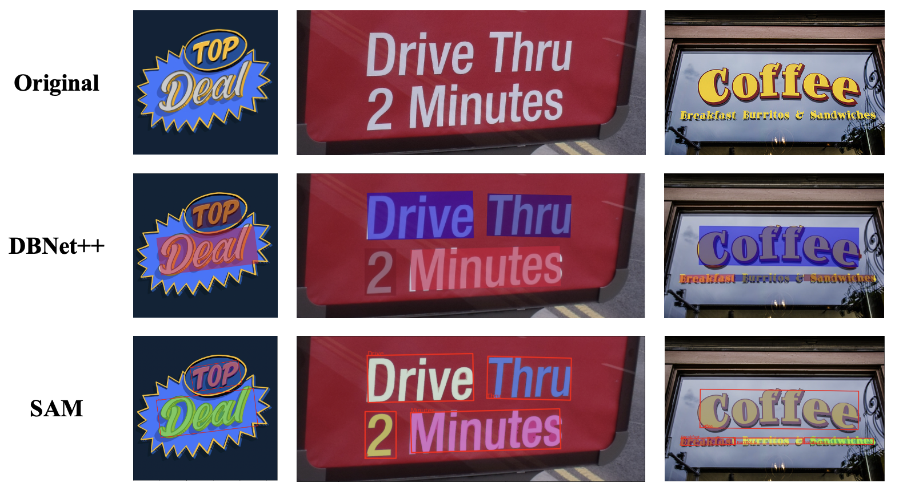

# Optical Character Recognition with Segment Anything (OCR-SAM)

## 🐇 Introduction 🐙
Can [SAM](https://github.com/facebookresearch/segment-anything) be applied to OCR? We take a simple try to combine two off-the-shelf OCR models in [MMOCR](https://github.com/open-mmlab/mmocr) with SAM to develop some OCR-related application demos, including **[SAM for Text](#sam-for-text)**, **[Text Removal](#erasing)** and **[Text Inpainting](#inpainting)**. And we also provide a **[WebUI by gradio](#run-webui)** to give a better interaction.  

## 📅 Updates 👀
- **2023.08.23**: 🔥 We create a repo **[yeungchenwa/Recommendations-Diffusion-Text-Image](https://github.com/yeungchenwa/Recommendations-Diffusion-Text-Image)** to provide a paper collection of recent diffusion models for text-image generation tasks.
- **2023.04.14**: 📣 Our repository is migrated to **[open-mmlab/playground](https://github.com/open-mmlab/playground#-mmocr-sam)**.
- **2023.04.12**: Repository Release
- **2023.04.12**: Supported the **[Inpainting](#inpainting🥸)** combined with DBNet++, SAM and Stable-Diffusion.
- **2023.04.11**: Supported the **[Erasing](#erasing🤓)** combined with DBNet++, SAM and Latent-Diffusion / Stable-Diffusion.
- **2023.04.10**: Supported the **[SAM for text](#sam-for-text🧐)** combined tieh DBNet++ and SAM.
- **2023.04.09**: How effective is the SAM used on OCR Text Image, we've discussed it in the **[Blog](https://www.zhihu.com/question/593914819/answer/2976012032)**.

## 📸 Demo Zoo 🔥

This project includes:
- [x] [SAM for Text](#sam-for-text🧐): DBNet++ + SAM

- [x] [Erasing](#erasing🤓): DBNet++ + SAM + Latent-Diffusion / Stable Diffusion 

- [x] [Inpainting](#inpainting🥸): DBNet++ + SAM + Stable Diffusion


## 🚧 Installation 🛠️
### Prerequisites(Recommended)

- Linux | Windows
- Python 3.8
- Pytorch 1.12
- CUDA 11.3

### Environment Setup
Clone this repo:
```bash
git clone https://github.com/yeungchenwa/OCR-SAM.git
```
**Step 0**: Download and install Miniconda from the [official website](https://docs.conda.io/en/latest/miniconda.html).  

**Step 1**: Create a conda environment and activate it.
```bash
conda create -n ocr-sam python=3.8 -y
conda activate ocr-sam
```
**Step 2**: Install related version Pytorch following [here](https://pytorch.org/get-started/previous-versions/).
```bash
# Suggested
pip install torch==1.12.1+cu113 torchvision==0.13.1+cu113 --extra-index-url https://download.pytorch.org/whl/cu113
```
**Step 3**: Install the mmengine, mmcv, mmdet, mmcls, mmocr.
```bash
pip install -U openmim
mim install mmengine
mim install mmocr
# In Window, the following symbol ' should be changed to "
mim install 'mmcv==2.0.0rc4'
mim install 'mmdet==3.0.0rc5'
mim install 'mmcls==1.0.0rc5'


# Install sam
pip install git+https://github.com/facebookresearch/segment-anything.git

# Install required packages
pip install -r requirements.txt
```

**Step 4**: Prepare for the diffusers and latent-diffusion.
```bash
# Install Gradio
pip install gradio

# Install the diffusers
pip install diffusers

# Install the pytorch_lightning for ldm
pip install pytorch-lightning==2.0.1.post0
```

## 📒 Model checkpoints 🖥

We retrain DBNet++ with Swin Transformer V2 as the backbone on a combination of multiple scene text datsets (e.g. HierText, TextOCR). **Checkpoint for DBNet++ on [Google Drive (1G)](https://drive.google.com/file/d/1r3B1xhkyKYcQ9SR7o9hw9zhNJinRiHD-/view?usp=share_link)**.  

And you should make dir following:  
```bash
mkdir checkpoints
mkdir checkpoints/mmocr
mkdir checkpoints/sam
mkdir checkpoints/ldm
mv db_swin_mix_pretrain.pth checkpoints/mmocr
```

Download the rest of the checkpoints to the related path (If you've done so, ignore the following):
```bash

# mmocr recognizer ckpt
wget -O checkpoints/mmocr/abinet_20e_st-an_mj_20221005_012617-ead8c139.pth https://download.openmmlab.com/mmocr/textrecog/abinet/abinet_20e_st-an_mj/abinet_20e_st-an_mj_20221005_012617-ead8c139.pth

# sam ckpt, more details: https://github.com/facebookresearch/segment-anything#model-checkpoints
wget -O checkpoints/sam/sam_vit_h_4b8939.pth https://dl.fbaipublicfiles.com/segment_anything/sam_vit_h_4b8939.pth

# ldm ckpt
wget -O checkpoints/ldm/last.ckpt https://heibox.uni-heidelberg.de/f/4d9ac7ea40c64582b7c9/?dl=1
```

## 🏃🏻‍♂️ Run Demo 🏊‍♂️

### **SAM for Text**🧐

Run the following script:
```bash
python mmocr_sam.py \
    --inputs /YOUR/INPUT/IMG_PATH \ 
    --outdir /YOUR/OUTPUT_DIR \ 
    --device cuda \ 
```
- `--inputs`: the path to your input image. 
- `--outdir`: the dir to your output. 
- `--device`: the device used for inference. 

### **Erasing**🤓

In this application demo, we use the [latent-diffusion-inpainting](https://github.com/CompVis/latent-diffusion#inpainting) to erase, or the [Stable-Diffusion-inpainting](https://huggingface.co/docs/diffusers/api/pipelines/stable_diffusion/inpaint) with text prompt to erase, which you can choose one of both by the parameter `--diffusion_model`. Also, you can choose whether to use the SAM output mask to erase by the parameter `--use_sam`. More implementation **details** are listed [here](docs/erase_details.md)

Run the following script:
```bash
python mmocr_sam_erase.py \ 
    --inputs /YOUR/INPUT/IMG_PATH \ 
    --outdir /YOUR/OUTPUT_DIR \ 
    --device cuda \ 
    --use_sam True \ 
    --dilate_iteration 2 \ 
    --diffusion_model \ 
    --sd_ckpt None \ 
    --prompt None \ 
    --img_size (512, 512) \ 
```
- `--inputs `: the path to your input image.
- `--outdir`: the dir to your output. 
- `--device`: the device used for inference. 
- `--use_sam`: whether to use sam for segment.
- `--dilate_iteration`: iter to dilate the SAM's mask.
- `--diffusion_model`: choose 'latent-diffusion' or 'stable-diffusion'.
- `--sd_ckpt`: path to the checkpoints of stable-diffusion.
- `--prompt`: the text prompt when use the stable-diffusion, set 'None' if use the default for erasing.
- `--img_size`: image size of latent-diffusion.  

**Run the WebUI**: see [here](#📺-run-webui-📱)

**Note: The first time you run may cost some time, because downloading the stable-diffusion ckpt costs a lot, so wait patiently👀**

### **Inpainting**
More implementation **details** are listed [here](docs/inpainting_details.md)

Run the following script:
```bash
python mmocr_sam_inpainting.py \
    --img_path /YOUR/INPUT/IMG_PATH \ 
    --outdir /YOUR/OUTPUT_DIR \ 
    --device cuda \ 
    --prompt YOUR_PROMPT \ 
    --select_index 0 \ 
```
- `--img_path`: the path to your input image. 
- `--outdir`: the dir to your output. 
- `--device`: the device used for inference. 
- `--prompt`: the text prompt.
- `--select_index`: select the index of the text to inpaint.

### **Run WebUI**
This repo also provides the WebUI(decided by gradio), including the Erasing and Inpainting.  

Before running the script, you should install the gradio package:
```bash
pip install gradio
```

#### Erasing
```bash
python mmocr_sam_erase_app.py
```
- **Example**:  

**Detector and Recognizer WebUI Result**
 

**Erasing WebUI Result**
  

In our WebUI, users can interactly choose the SAM output and the diffusion model. Especially, users can choose which text to be erased.

#### Inpainting🥸
```bash
python mmocr_sam_inpainting_app.py
```
- Example:  

**Inpainting WebUI Result**


**Note: Before you open the web, it may take some time, so wait patiently👀** 

## 💗 Acknowledgement
- [segment-anything](https://github.com/facebookresearch/segment-anything)
- [latent-diffusion](https://github.com/CompVis/latent-diffusion)
- [mmocr](https://github.com/open-mmlab/mmocr)
